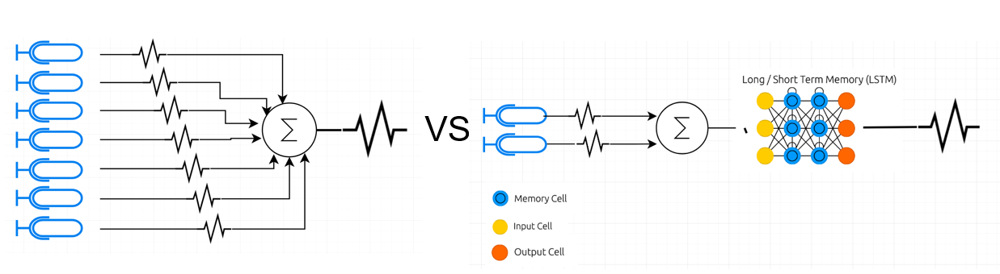

# Aero_ML: An aeroacoustic Machine Learning Repository

[example]: "Machine learning application"

This machine learning project's goal is to take raw audio data from CSU Fullerton's anechoic Wind Tunnel, training a machine learning model with 2 microphone inputs and output the performance of 7 beamformed microphones. This project repo is in MATLAB using the following dependencies:

- Audio Toolbox
- Deep Learning Toolbox
- MATLAB
- Parallel Computing Toolbox
- Signal Processing Toolbox

Future work on this project will include the code transition into Python 3.6 using Keras, and further development to increase the accuracy of the model(s).

## Project Overview

Overall this graduate project was a compilation of 3 items. The first was the renovation of the test section and addition of a permanent datum in the form of a dowel pin which also serves as an alignment feature. The second is the enhancement of the anechoic setup. Lastly and most importantly (required by the 2 previous items) collect a validation set of testing data and train an LSTM or BiLSTM to have a prediction outputted from data that hasn't been seen before by the model.

This git will have a small sample of test files and couple .mat files with most of the data set read into a .mat file structure

# References and Appendix?

Created by: Andrew Bartels, Graduate student Cal State, Fullerton
